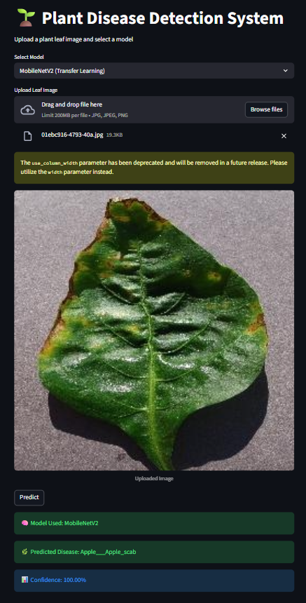
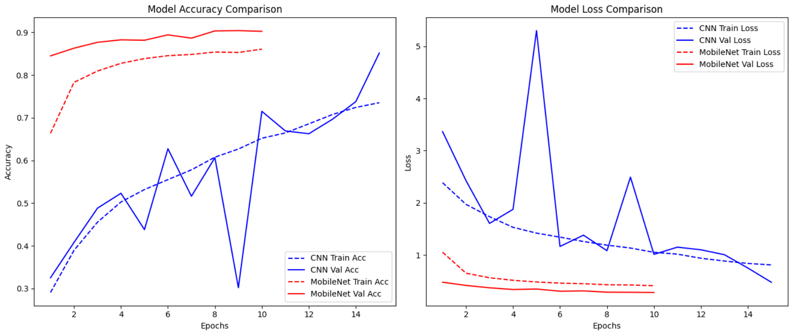

# 🌱 Plant Disease Detection Model  
### Comparative Analysis using Custom CNN and MobileNetV2

An end-to-end deep learning project for **plant leaf disease detection** using **CNNs**.  
The system compares a **Custom CNN (from scratch)** with **MobileNetV2 (Transfer Learning)** and provides predictions through an **interactive Streamlit web application**.

---

## 🚀 Project Highlights

- ✅ Custom CNN built from scratch (baseline model)
- ✅ Transfer Learning using MobileNetV2 
- ✅ Multi-class plant disease classification (PlantVillage dataset)
- ✅ Model comparison (accuracy, confidence, model size)
- ✅ Deployed as a Streamlit web application
- ✅ End-to-end ML pipeline (training → evaluation → deployment)

---

## 📌 Motivation

Plant diseases significantly affect agricultural productivity.  
Early and accurate detection can help farmers take timely action and reduce crop loss.

This project aims to:
- Automate disease detection from leaf images
- Compare traditional CNN learning with transfer learning
- Provide a usable web-based interface for predictions

---

## 🧠 Models Used

### 1️⃣ Custom CNN (From Scratch)
- Input size: `128 × 128 × 3`
- 3 Convolution blocks (Conv → BatchNorm → MaxPool)
- Dropout for regularization
- Dense classifier with Softmax output

**Purpose:**  
To understand feature extraction and establish a baseline.

---

### 2️⃣ MobileNetV2 (Transfer Learning)
- Pretrained on ImageNet
- Frozen base layers
- Custom classification head
- Input size: `224 × 224 × 3`

**Purpose:**  
To achieve higher accuracy, faster convergence, and better generalization.

---

## 📊 Model Comparison (Summary)

| Feature | Custom CNN | MobileNetV2 |
|------|-----------|-------------|
| Training Speed | Slower | Faster |
| Accuracy | Moderate | Higher |
| Model Size | Larger | Smaller |
| Industry Usage | Low | High |

---

## 🗂 Dataset

**PlantVillage Dataset (Kaggle)**  
- Contains multiple plant species and disease categories
- Publicly available and widely used in research

Dataset link:  
https://www.kaggle.com/datasets/emmarex/plantdisease

---

## 🖥 Web Application (Streamlit)

The Streamlit app allows users to:
- Upload a plant leaf image
- Select the model (Custom CNN or MobileNetV2)
- View predicted disease and confidence score

---

## 📸 Application Screenshots

### 🔹 Main Interface


### 🔹 Training & Validation Performance



---

## ⚙️ How to Run the Project Locally

### 1️⃣ Clone the repository
```bash
git clone https://github.com/your-username/Comparative-Analysis-of-Plant-Disease-Detection-Using-Custom-CNN-and-MobileNetV2.git
cd Comparative-Analysis-of-Plant-Disease-Detection-Using-Custom-CNN-and-MobileNetV2

### 2️⃣ Install dependencies
```bash
pip install -r requirements.txt

### 3️⃣ Run the Streamlit app
streamlit run app.py

### The application will open in your browser at:

http://localhost:8501

### 📁 Project Structure
plant-disease-detection/
│
├── app.py                         # Streamlit application
├── custom_cnn_plant_disease.h5    # Custom CNN model
├── mobilenetv2_plant_disease.h5   # Transfer Learning model
├── requirements.txt               # Dependencies
├── screenshots/                   # App screenshots
│   ├── app_ui.png
│   └── prediction.png
└── README.md

### 🎯 Key Learnings

Difference between CNN from scratch and transfer learning

Importance of data preprocessing and augmentation

Model evaluation and comparison

Deployment of ML models using Streamlit

Version control and GitHub workflow from Colab
